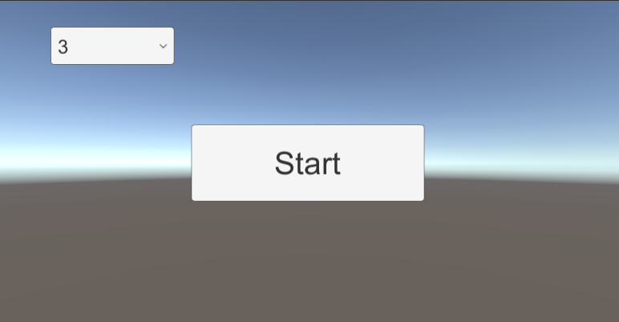
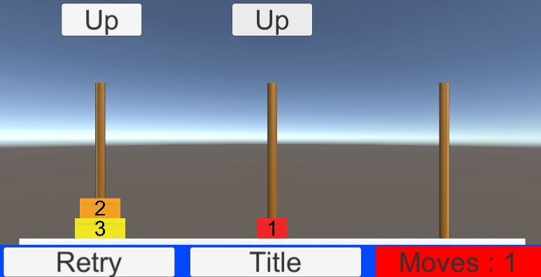

# ハノイの塔
- パズルゲームの一種です(<a href="https://ja.wikipedia.org/wiki/%E3%83%8F%E3%83%8E%E3%82%A4%E3%81%AE%E5%A1%94">wiki</a>)。
- 3~7段に設定して遊べます。
 

## イメージ

タイトル画面

 

メイン画面

 
 

## 動作環境など
- WebGLの780×405で動作するように作成しました。
 

## BGM・効果音について
- 本来は効果音・BGM付ですが、<b>フリー素材の著作権の都合上消しました</b>。
- 「TitleScene」の「TitleDirector」、「MainScene」の「Director」オブジェクトにお好みの音源を割り当ててあげてください。
  

## Sceneについて
- InitScene：初期設定などのためのシーン。最初にこのシーンが読み込まれ、直後に下記の「TitleScene」が呼ばれます。
- TitleScene：タイトル画面。段数の設定(3~7)をできます。
- MainScene：ゲーム画面。このシーンでハノイの塔を遊べます。
  

## 使用パッケージ
- DOTWEEN：アニメーションのために使用。
  
